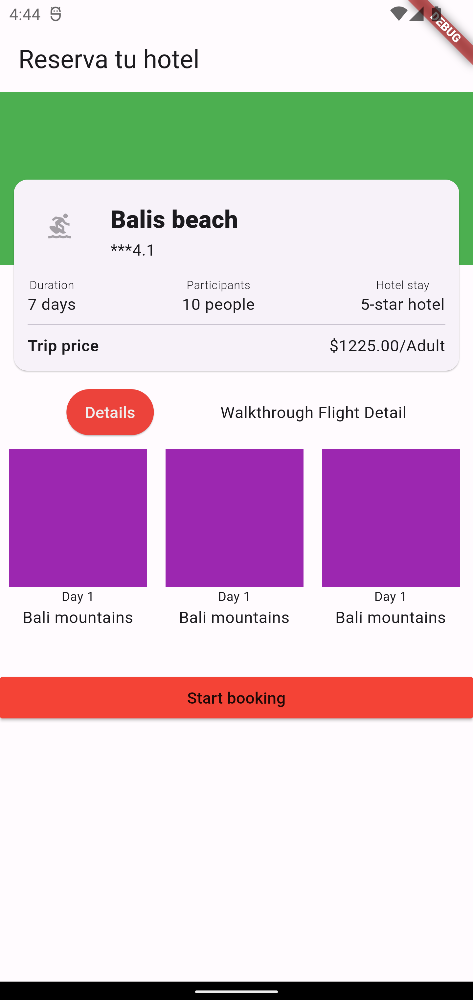

# Tarea 3 - Alineaciones y estilos / Vacacionando App

Realizar los siguientes cambios a la UI
- El container verde se debe quitar y en su lugar agregar una imagen que tenga la altura igual a la cuarta parte del espacio disponible en pantalla al igual que las cuatro esquinas redondeadas.
- El icono que está como leading del list tile debe tener un tamaño de 48 y color indigo.
- El text de *** en el subtitle del list tile se debe cambiar por 4 iconos de estrella color amarillos
- Los elementos del list view horizontal en lugar cada container morado deben tener imágenes distintas con el mismo tamaño que tiene el container, el texto de “Day 1” no se debe repetir, en su lugar el primer elemento debería decir Day 1, el segundo Day 2 y así hasta el quinto elemento. El nombre del lugar en vez de ser Bali mountain, cambielo por nombres de lugares turísticos para cada elemento de la lista también.
- El botón rojo “Start booking” debe tener el texto de color blanco o grey[200]
- El botón rojo “Start booking” debe mostrar un snack bar que diga “Reservación en progreso”.

## App Screenshot
### App base

### App modificada

https://github.com/desparza13/Tareas_Programacion_Dispositivos_Moviles/assets/56266109/c40a4fd1-935a-4159-9dc1-468191e80241

